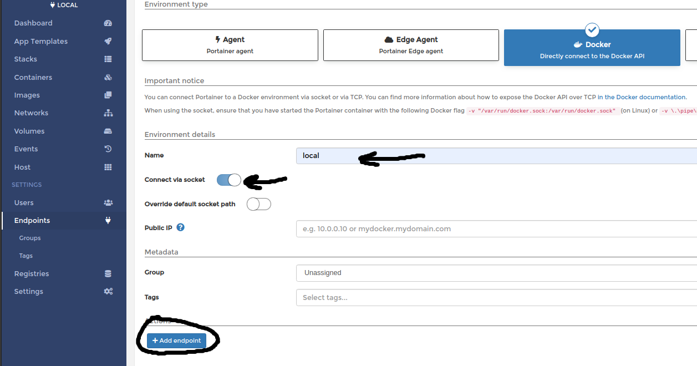

# Descargar y correr una imagen

Portainer: Herramienta para visualizar y gestionar Docker (https://www.portainer.io/)

## Descripción

Apoyandonos de la [documentación oficial](https://documentation.portainer.io/v2.0/deploy/ceinstalldocker/)

### Portainer Server Deployment

     docker volume create portainer_data

Crea un volumen para persistir datos

    docker run -d -p 8000:8000 -p 9000:9000 --name=portainer --restart=always -v /var/run/docker.sock:/var/run/docker.sock -v portainer_data:/data portainer/portainer-ce

Descripción del comando:
- docker run: Comando de Docker para correr una imagen.
- -d : Detached, devuelve el control del terminal

- -p 8000:8000 -p 9000:9000 : Port binding, expone los puertos 8000 y 9000 del contenedor por los puertos 8000 y 9000 del host.

- --name=portainer : declara el nombre del contenedor como "portainer"

- --restart=always : Fuerza el reincio del contenedor en caso que este se detenga (como es el caso de fallos internos).

- -v /var/run/docker.sock:/var/run/docker.sock : Monta el socket de docker para poder acceder desde el contenedor al proceso de docker

- -v portainer_data:/data : utiliza el volumen creado en el paso anterior para persistir los datos de la aplicación

- portainer/portainer-ce : Simplemente nombra la imagen necesaria para correr el contenedor.

## Corriendo la apliación

- http://localhost:9000/
- Ir a settings/Endpoints
- Seleccionar Docker (Directly connect to the Docker API)
- Poner nombre al ambiente
- Add endpoint
 
